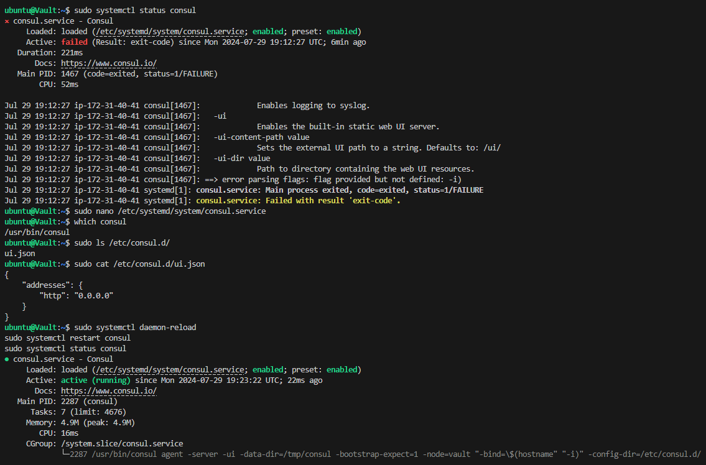

# Auto-discovery-end-to-end-project
My personal end to end pet-clinic auto discovey project 

# Project Overview

This project focuses on automating the process of continuous integration and delivery using a Jenkins pipeline. It eliminates manual steps by automating actions between staging and production environments. The pipeline sequence demonstrates continuous integration up to the staging phase and continuous delivery to the production environment. Additionally, it showcases the use of an Auto Scaling Group (ASG) to launch instances from the staging environment to the production setup.

# Key Features

Automated Deployment: Jenkins triggers Ansible playbooks to dynamically update IP addresses in the host inventory file whenever ASG modifies instances.
Continuous Delivery: The pipeline facilitates the deployment of Docker images as containers within the Docker host environment.
Vault Integration: All processes are initiated upon activating the vault component.

# Tools and Technologies

Terraform (IAC): For infrastructure automation and management.
Ansible: For configuration management and application deployment.
Vault: For secure storage of secrets and sensitive data.
SonarQube: For continuous inspection of code quality.
Jenkins: For automating the CI/CD pipeline.
New Relic: For monitoring application performance and infrastructure.
Slack: For team communication and notifications.
GitHub: For version control and collaboration.
Nexus: For repository management.
Docker Hub: For container image storage.
Amazon Web Services (AWS): For cloud infrastructure.
Visual Studio Code: For development and editing.

# Setting up github repository
A github repo is created for this project. Even though this is a solo project a testing branch is created so that 
code can be organized, tested and experimented outside of the main branch, once tested it is pushed to main.

# First file- adding .gitignore file
Once the github repository is created the first file to be added is the .gitignore file. 
The file names mentioned in the .gitignore are ignored by git meaning when using "git add ." command
they are not included for the push as they are not required in the repo, these are mostly auto generated files which
serve other purposes and can cause issues when pushed such as delay with bigger files.

# Project structure
Modules will be used to structure this project. using modules in Terraform is a best practice for
structuring code, making it more maintainable, reusable, and easier to understand.
By breaking down the infrastructure into smaller, self-contained modules, the root
main.tf file can be kept concise and focused on high-level orchestration.
For automation scripts in this project functions are used. Isolating tasks within functions makes
debugging easier. If an error occurs, we can quickly identify which function is responsible and address
it. Functions also make it easier to maintain and update the script since changes can be made in 
a localized manner without affecting the entire script. Scripts with functions are also generally more
readable. Each function performs a distinct task, which is clearly defined by its name and purpose.
This helps both the author and other developers quickly understand what the script does.

# Following modules added

# Keypair
Module folder created, Keypair folder added as first module and root main.tf created.
The first module to be added is the keypair, A folder named Keypair is created under module folder and the
main.tf, variable.tf and output.tf is added to it. The root main.tf is also created on the project path outside module folder.
The keypair main.tf contains the AWS resources, the output.tf contains
values assigned to these resources once created and the variable.tf contains variables that have their values 
assigned in the root main.tf which is outside the module folder.All module folders will follow this base pattern 
(main.tf,output.tf, variable.tf and root main.tf). For the keypair main.tf three resources are created. 1. It generates an RSA key pair,
2. The private key is stored locally with secure permissions, 3. The public key is uploaded to AWS to be used as an EC2 key pair.
This setup is used to ensure that the private key remains secure while the public key is made available for SSH access to AWS instances.

# VPC
The vpc module creates a VPC with the following capabilities:

Isolation and Control: Provides an isolated networking environment where network configurations can be defined and traffic flow can be controlled.

Internet Access: Through the IGW and route tables, it manages public and private access to the internet.

Outbound Connectivity: Using the NAT Gateway, it enables private instances to access the internet while remaining protected from direct inbound traffic.

Segmentation: Separates resources into public and private subnets, allowing for different security and access policies based on the nature of the resources.

The VPC setup is crucial for managing network traffic, securing resources, and enabling connectivity between different AWS services and the internet.  It provides complete control over the virtualized network environment, including the ability to define IP address ranges, subnets, route tables, and network gateways. It forms the backbone of the AWS infrastructure, ensuring that resources are correctly segmented, secure, and have the required access to external networks.

# Security groups 
The security group module is created to contain all the AWS security group resources required for this project. The inbound rules allow 
certain ports on each security group and only allow what is required and nothing else for each instance it references.

# Bastion host
Next the bastion host is worked on. A folder named bastion is created under module folder and the
main.tf, variable.tf and output.tf is added to it along with the automation script for the bastion 
ec2 instance, this instance will be used for ssh access to any instances using a private IP as they
cannot be accessed directly.

# Sonarqube
Sonarqube module is created next. It will be used for code analysis and to measure its quality and identify issues. SonarQube's Quality Gate 
feature is being used to enforce quality standards. If the code doesn't pass the Quality Gate, the pipeline stops, ensuring that only 
high-quality code proceeds through the pipeline. Along with sonarqube being installed in the sonarqube script Postgresql is being 
installed as a backend database for storing SonarQube's data. Nginx is also installed on the script to handle web traffic, provide SSL 
termination, and improve security. Along with the ec2 resource on main.tf an ELB is also created to load balance traffic. 

New relic

New relic is also downloaded and installed on the sonarqube script with the API key and account ID specified. This is also carried out in the jenkins, Nexus and ASG scripts. With New Relic installed across the entire stack (Jenkins, Nexus, SonarQube, and ASG instances), centralized observability is gained, making it easier to correlate events and understand the impact of changes:

Unified Dashboard: You can have a single dashboard in New Relic that shows the health and performance of all your services, making it easier to manage and troubleshoot your infrastructure.

End-to-End Visibility: New Relic provides end-to-end visibility from the application layer down to the infrastructure, allowing you to see how changes in one part of the system affect the others.

New Relic in the SonarQube, Nexus, Jenkins, and production/staging ASG instances is crucial for monitoring, alerting, and optimizing applications and infrastructure. It provides real-time insights, helps manage performance and health, and integrates seamlessly with DevOps practices, ensuring that the services are reliable, performant, and scalable. New Relic has also been set up to send alerts directly to the Cloudhight Slack channel. This is a great way to keep the team informed in real-time about critical events happening in the infrastructure.

# Nexus
Nexus module is created. Nexus is being used as both a repository manager for storing build artifacts and as a Docker registry for
managing Docker images. Artifact Repository (nexus-repo): It stores and manages versioned build artifacts like the .war file, ensuring that they are easily accessible for deployment or future builds.
Docker registry (docker-repo): It manages Docker images, allowing them to be stored, versioned, and accessed across various environments. This centralization helps in consistent deployment and easy rollback in case of issues. An ELB is created for load balancing.

# Jenkins
Jenkins module is created. Jenkins is a powerful, open-source automation server that is widely used for continuous integration (CI) and continuous delivery (CD). Jenkins acts as the central automation hub, coordinating various tools and processes to ensure that the application is built, tested, secured, and deployed efficiently and reliably.Jenkins orchestrates the entire process of building, testing, analyzing, securing, and deploying the Spring Petclinic Java application.On the jenkins script docker is installed along with Jenkins. Docker is necessary to create these images directly on the Jenkins instance.
After building Docker images, Jenkins can use Docker to push these images to the Docker registry in Nexus which can then be used for deployment in various environments.
An application load balancer is also created on the main.tf to load balance traffic. The Jenkins pipeline script involves web-based activities like interacting with SonarQube, Nexus, and deploying artifacts, all of which are HTTP/HTTPS-based interactions. ALB is specifically designed to handle HTTP/HTTPS traffic, making it a good fit for Jenkins.

# Ansible
Ansible module is created next. Ansible is used to automate the deployment of the application to staging and production environments. It ensures consistent, repeatable, and automated deployments by executing predefined playbooks on the target servers via SSH. This setup helps streamline the deployment process, reduce errors, and maintain uniformity across different environments. Along with the ansible script itself there is an auto discovery script for both stage and prod, and
also a stage and prod yml playbook. On the ansible script there is a cronjob set to execute the auto discovery script every minute. This means every minute the instance will check for AWS instances spun up by ASG, it will then update the ansible inventory file with current instances and check and start docker container if not running already. 

# RDS
An RDS module is created with an AWS DB instance and subnet group. The RDS instance is the backbone of the pet clinic application’s data layer. It stores all the crucial information about vets, clients, and other entities, ensuring that the data is persistently available, consistent, and secure. By leveraging RDS, the application benefits from a fully managed, reliable, and scalable database solution that supports its core operations. The application connects to the RDS instance using the credentials provided: spring.datasource.username and spring.datasource.password which is going to be retrieved from the vault. 

# Stage and prod load balancers
For the staging and production environments application load balancers are used. Whilst elastic load balancers provide a straightforward and efficient way to distribute traffic without the need for complex routing configurations for Nexus, Sonarqube and Vault, ALB’s advanced routing capabilities and Layer 7 functionality make it a better fit for production and staging environments where there may be a need to handle web traffic, route requests based on content, or manage complex application architectures.

# Stage and prod auto scaling group 
The stage and prod asg module main.tf consists of a launch template, an auto scaling group and an autoscaling policy. the launch template will spin up new ASG EC2
instances running a script not only to install and start docker on new instances, but to check and stop current running containers and deploy latest image in container. These EC2 instances are responsible for running the actual application (in this case, the PetClinic Java application) that people use when they visit stage.ticktocktv.com and prod.ticktocktv.com. The application is packaged into a Docker container, making it portable and ensuring that it runs consistently across different environments. The EC2 instances pull the latest Docker image from the Nexus repository, deploy it, and run it, making the application accessible via the respective URLs. New ASG instances will be deployed in accordance to configurations set in the auto scaling group and autoscaling policy. This includes max, min and desired number of ASG instances and a CPU utilization metric on the policy where a new instance will be spun up if CPU usage exceeded. 

# Route 53
Route 53 is primarily used to manage DNS records for the ticktocktv.com domain. DNS is crucial for converting human-readable domain names into IP addresses that machines use to locate each other on the network. By using Route 53, DNS records can be managed and integrated with other AWS services easily. Type A records are created for Jenkins, Nexus, SonarQube, and the production and staging environments. The code ensures that all of these services have their own subdomains (e.g., jenkins.ticktocktv.com, nexus.ticktocktv.com), which makes it easy to access them via their respective URLs. This centralizes DNS management, ensuring that all the services can be accessed through a consistent domain structure. The alias blocks in the Route 53 records for Jenkins, Nexus, SonarQube, production, and staging environments are used to point the DNS records to the respective load balancers. This means when someone accesses jenkins.ticktocktv.com, Route 53 resolves this to the DNS name of the Jenkins load balancer, which then routes the traffic to the appropriate EC2 instances.

This concludes the modules used in this project

# HashiCorp Vault
A folder for Hashicorp vault is created, the vault is standalone so this folder contains the vaults own main.tf and backend.tf among multiple other files. As it is standalone vault will not use the custom VPC set up in the module folder. On the main.tf public, private keys and KMS key are created along with the vaults own security group and route 53 record. The ACM cert is created here and is validated with a validation cert. It is used to secure network communications by enabling encryption via the SSL/TLS protocol and enabling secure HTTPS connections on the ticktocktv.com domains used throughout the project. An ELB is added for load balancing vault.ticktocktv.com.

In this project the RDS database username and randomly generated password generated in the vault script are stored. Using HashiCorp Vault to manage RDS credentials offers superior security, compliance, and operational benefits compared to traditional methods. It minimizes the risk of credential exposure, has features that can automate credential lifecycle management, and provides centralized control, auditing, and governance capabilities. This makes it a robust solution for managing secrets in a secure and scalable manner. Consul is also installed in the script, Vault’s integration with Consul provides a highly available storage backend, ensuring that the  secrets are consistently available even in the case of node failures. Along with the vault script a vault_iam.tf is created for KMS access on the ec2 instance. In the Vault configuration, KMS (AWS Key Management Service) is used as a seal mechanism. This means that Vault’s encryption keys are encrypted using KMS, and Vault cannot operate (i.e., it remains sealed) until KMS is used to decrypt these keys. 

A retrieve_token.sh script is added so that the root token is available on the local machine after spinning up the vault infrastrucure and is removed after destroying infrastructure(provisioner set to remove on main.tf), this token is required to login to vault.ticktocktv.com and also required by RDS to access the secret creds. The setup_env_vars.sh file on root directly also depends on this script as it pulls the token from vault folder.  

This file is create the remote backend and store the state file on its own vault folder in S3 while also specifying the dynamoDB table and region that has been created in create_remote_state.sh.

# Root level files
# Create/delete remotestate.sh files
For this project the state files for vault and root are stored in S3 as opposed to being stored on local machine. The files are AWS CLI commands and when they are run they will create/delete the S3 bucket and folders along with the dynamoDB table for state locking.

On team projects this allows multiple team members or CI/CD pipelines to access the same state file, ensuring that everyone works with the most up-to-date infrastructure state. For a solo project this doesn't factor, but having the state file on S3 with DynamoDB is significantly safer and more reliable than keeping it on a local machine. In the event of hardware failure or loss, using S3 ensures that the state file is preserved, accessible, and protected, allowing to manage the infrastructure without interruption. Without the state file, Terraform cannot accurately determine what resources have been created or modified. This makes it extremely difficult to manage or update the infrastructure, as Terraform would be unable to know which resources need to be added, modified, or destroyed. This setup provides peace of mind by safeguarding against unforeseen disasters. It can provide added security, reliability, and future-proofing. 

# Setup_env_vars.sh file 
This file is designed to be run on root level before spinning up root infrastructure and after spinning up vault and running retrieve_token.sh. It sets the environment variables VAULT_ADDR and VAULT_TOKEN required for RDS to access the vaults secret DB username and password.

# Backend.tf file 
This file is create the remote backend and store the state file on its own root folder on S3 while also specifying the dynamoDB table and region that has been created in create_remote_state.sh.

This concludes the IAC section of this project

# Spinning up infrastructure
Firstly the terminal is accessed on root level, the create_remote_state.sh script is ran to spin up the remote state infrastructure. The vault folder is then accessed and terraform init is ran, the initilization confirms the remote s3 backend created in create_remote_state.sh is set. This is confirmed by checking the AWS console. Terraform plan is run and there is a few issues. General typo's in code along with other small corrections is carried out and terraform apply succeeds. SSH into the vault server confirms there are a few issues that need fixed. The first issue noticed is Consul failed to start. this is worked on with a few commands and rectified, the daemon reload and start consul commands are added to the vault script .
