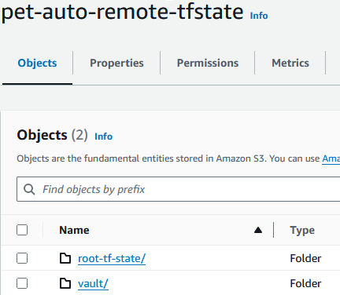

# Auto-discovery-end-to-end-project
My personal end to end pet-clinic auto discovey project 

# Setting up github repository
A github repo is created for this project. Even though this is a solo project a testing branch is created so that 
code can be organized, tested and experimented outside of the main branch, once tested it is pushed to main.

# First file- adding .gitignore file
Once the github repository is created the first file to be added on VScode is the .gitignore file. 
The file names mentioned in the .gitignore are ignored by git meaning when using "git add ." command
they are not included for the push as they are not required in the repo and can cause issues when 
pushed such as delay with bigger files.

# 2nd task- Configure AWS resources: EC2 instances, VPC, subnets, security groups, IAM roles, etc.
Modules will be used to structure this project. using modules in Terraform is a best practice for
structuring code, making it more maintainable, reusable, and easier to understand.
By breaking down the infrastructure into smaller, self-contained modules, the root
main.tf file can be kept concise and focused on high-level orchestration.
For automation scripts in this project functions are used. Isolating tasks within functions makes
 debugging easier. If an error occurs, we can quickly identify which function is responsible and address
it. Functions also make it easier to maintain and update the script since changes can be made in 
a localized manner without affecting the entire script. Scripts with functions are also generally more
readable. Each function performs a distinct task, which is clearly defined by its name and purpose.
This helps both the author and other developers quickly understand what the script does.

# Setting up bastion host
Next the bastion host is worked on. A folder named bastion is created under module folder and the
 main.tf, variable.tf and output.tf is added to it along with the automation script for the bastion 
 ec2 instance, this instance will be used for ssh access to any instances using a private IP as they
  cannot be accessed directly. Mysql